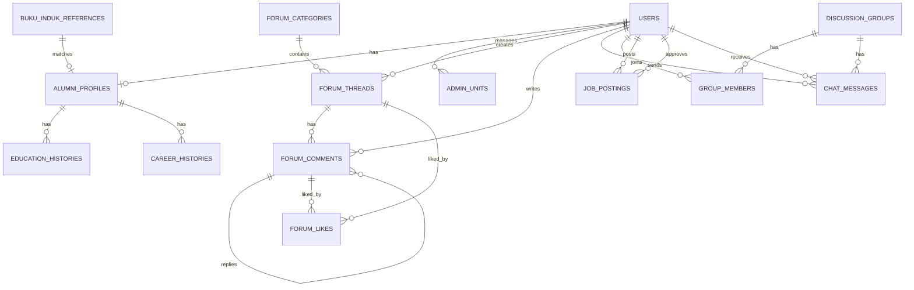

# Database Schema & ERD — Koncolawas

## Entity Relationship Diagram



---

## 1. Master Data

### 1.1 users

Tabel utama untuk autentikasi (Google SSO) dan role.

| Column | Type | Constraints | Notes |
|---|---|---|---|
| id | UUID | PK, default gen_random_uuid() | |
| google_id | VARCHAR(255) | UNIQUE, NOT NULL | ID dari Google |
| email | VARCHAR(255) | UNIQUE, NOT NULL | Email dari Google |
| name | VARCHAR(255) | NOT NULL | Nama dari Google |
| role | ENUM('super_admin', 'admin_unit', 'alumni') | NOT NULL, DEFAULT 'alumni' | |
| avatar_url | VARCHAR(500) | | Foto dari Google |
| is_active | BOOLEAN | NOT NULL, DEFAULT true | |
| last_login_at | TIMESTAMP | | |
| created_at | TIMESTAMP | NOT NULL, DEFAULT NOW() | |
| updated_at | TIMESTAMP | NOT NULL, DEFAULT NOW() | |

```sql
CREATE TYPE user_role AS ENUM ('super_admin', 'admin_unit', 'alumni');

CREATE TABLE users (
    id UUID PRIMARY KEY DEFAULT gen_random_uuid(),
    google_id VARCHAR(255) UNIQUE NOT NULL,
    email VARCHAR(255) UNIQUE NOT NULL,
    name VARCHAR(255) NOT NULL,
    role user_role NOT NULL DEFAULT 'alumni',
    avatar_url VARCHAR(500),
    is_active BOOLEAN NOT NULL DEFAULT true,
    last_login_at TIMESTAMP,
    created_at TIMESTAMP NOT NULL DEFAULT NOW(),
    updated_at TIMESTAMP NOT NULL DEFAULT NOW()
);
```

### 1.2 buku_induk_references

Data referensi dari buku induk (import CSV). Tidak diedit oleh alumni, hanya admin.

| Column | Type | Constraints | Notes |
|---|---|---|---|
| id | UUID | PK | |
| nis | VARCHAR(30) | UNIQUE, NOT NULL | Nomor Induk Siswa |
| nama | VARCHAR(255) | NOT NULL | Nama sesuai dokumen |
| tahun_masuk | SMALLINT | NOT NULL | Tahun masuk SMA |
| jurusan | VARCHAR(10) | | IPA / IPS |
| kelas_3 | VARCHAR(20) | | Rombel kelas 3 (opsional) |
| is_matched | BOOLEAN | NOT NULL, DEFAULT false | Apakah sudah ada alumni yang mengklaim |
| matched_by | UUID | FK -> users.id, NULLABLE | Alumni yang mengklaim data ini |
| created_at | TIMESTAMP | NOT NULL, DEFAULT NOW() | |
| updated_at | TIMESTAMP | NOT NULL, DEFAULT NOW() | |

```sql
CREATE TABLE buku_induk_references (
    id UUID PRIMARY KEY DEFAULT gen_random_uuid(),
    nis VARCHAR(30) UNIQUE NOT NULL,
    nama VARCHAR(255) NOT NULL,
    tahun_masuk SMALLINT NOT NULL,
    jurusan VARCHAR(10),
    kelas_3 VARCHAR(20),
    is_matched BOOLEAN NOT NULL DEFAULT false,
    matched_by UUID REFERENCES users(id) ON DELETE SET NULL,
    created_at TIMESTAMP NOT NULL DEFAULT NOW(),
    updated_at TIMESTAMP NOT NULL DEFAULT NOW()
);
```

---

## 2. Profil Alumni

### 2.1 alumni_profiles

Data profil lengkap alumni. Satu user memiliki satu profil.

| Column | Type | Constraints | Notes |
|---|---|---|---|
| id | UUID | PK | |
| user_id | UUID | FK -> users.id, UNIQUE, NOT NULL | |
| buku_induk_id | UUID | FK -> buku_induk_references.id, NULLABLE | Jika match dengan buku induk |
| nis | VARCHAR(30) | | Diisi dari buku induk jika match |
| nama_lengkap | VARCHAR(255) | NOT NULL | |
| no_hp | VARCHAR(20) | NOT NULL | |
| tahun_masuk | SMALLINT | NOT NULL | |
| tahun_lulus | SMALLINT | NOT NULL | |
| jurusan | VARCHAR(10) | | IPA / IPS |
| kelas_1 | VARCHAR(20) | | Rombel kelas 1 (opsional) |
| kelas_2 | VARCHAR(20) | | Rombel kelas 2 (opsional) |
| kelas_3 | VARCHAR(20) | NOT NULL | Rombel kelas 3 — prioritas |
| kota_domisili | VARCHAR(100) | NOT NULL | |
| kecamatan_asal_boyolali | VARCHAR(100) | NOT NULL | |
| alamat_lengkap | TEXT | | Opsional |
| foto_profil | VARCHAR(500) | | URL file |
| link_linkedin | VARCHAR(500) | | |
| link_instagram | VARCHAR(500) | | |
| status_utama | VARCHAR(30) | NOT NULL | Bekerja/Kuliah/Wirausaha/Belum Bekerja/Lainnya |
| is_data_from_buku_induk | BOOLEAN | NOT NULL, DEFAULT false | |
| created_at | TIMESTAMP | NOT NULL, DEFAULT NOW() | |
| updated_at | TIMESTAMP | NOT NULL, DEFAULT NOW() | |

```sql
CREATE TYPE status_utama AS ENUM ('Bekerja', 'Kuliah', 'Wirausaha', 'Belum Bekerja', 'Lainnya');

CREATE TABLE alumni_profiles (
    id UUID PRIMARY KEY DEFAULT gen_random_uuid(),
    user_id UUID UNIQUE NOT NULL REFERENCES users(id) ON DELETE CASCADE,
    buku_induk_id UUID REFERENCES buku_induk_references(id) ON DELETE SET NULL,
    nis VARCHAR(30),
    nama_lengkap VARCHAR(255) NOT NULL,
    no_hp VARCHAR(20) NOT NULL,
    tahun_masuk SMALLINT NOT NULL,
    tahun_lulus SMALLINT NOT NULL,
    jurusan VARCHAR(10),
    kelas_1 VARCHAR(20),
    kelas_2 VARCHAR(20),
    kelas_3 VARCHAR(20) NOT NULL,
    kota_domisili VARCHAR(100) NOT NULL,
    kecamatan_asal_boyolali VARCHAR(100) NOT NULL,
    alamat_lengkap TEXT,
    foto_profil VARCHAR(500),
    link_linkedin VARCHAR(500),
    link_instagram VARCHAR(500),
    status_utama status_utama NOT NULL DEFAULT 'Lainnya',
    is_data_from_buku_induk BOOLEAN NOT NULL DEFAULT false,
    created_at TIMESTAMP NOT NULL DEFAULT NOW(),
    updated_at TIMESTAMP NOT NULL DEFAULT NOW()
);
```

### 2.2 education_histories

Riwayat pendidikan lanjutan alumni.

| Column | Type | Constraints | Notes |
|---|---|---|---|
| id | UUID | PK | |
| alumni_profile_id | UUID | FK -> alumni_profiles.id, NOT NULL | |
| jenjang | VARCHAR(5) | NOT NULL | D3 / S1 / S2 / S3 |
| institusi | VARCHAR(255) | NOT NULL | |
| jurusan | VARCHAR(255) | | |
| tahun_masuk | SMALLINT | | |
| tahun_lulus | SMALLINT | | NULL jika masih berlangsung |
| status | VARCHAR(10) | NOT NULL | Lulus / Sedang |
| created_at | TIMESTAMP | NOT NULL, DEFAULT NOW() | |
| updated_at | TIMESTAMP | NOT NULL, DEFAULT NOW() | |

```sql
CREATE TABLE education_histories (
    id UUID PRIMARY KEY DEFAULT gen_random_uuid(),
    alumni_profile_id UUID NOT NULL REFERENCES alumni_profiles(id) ON DELETE CASCADE,
    jenjang VARCHAR(5) NOT NULL,
    institusi VARCHAR(255) NOT NULL,
    jurusan VARCHAR(255),
    tahun_masuk SMALLINT,
    tahun_lulus SMALLINT,
    status VARCHAR(10) NOT NULL,
    created_at TIMESTAMP NOT NULL DEFAULT NOW(),
    updated_at TIMESTAMP NOT NULL DEFAULT NOW()
);
```

### 2.3 career_histories

Riwayat pekerjaan alumni.

| Column | Type | Constraints | Notes |
|---|---|---|---|
| id | UUID | PK | |
| alumni_profile_id | UUID | FK -> alumni_profiles.id, NOT NULL | |
| perusahaan | VARCHAR(255) | NOT NULL | |
| jabatan | VARCHAR(255) | NOT NULL | |
| sektor_industri | VARCHAR(100) | | |
| tahun_mulai | SMALLINT | | |
| tahun_selesai | SMALLINT | | NULL jika masih aktif |
| kota_penempatan | VARCHAR(100) | | |
| status | VARCHAR(10) | NOT NULL | Aktif / Selesai |
| created_at | TIMESTAMP | NOT NULL, DEFAULT NOW() | |
| updated_at | TIMESTAMP | NOT NULL, DEFAULT NOW() | |

```sql
CREATE TABLE career_histories (
    id UUID PRIMARY KEY DEFAULT gen_random_uuid(),
    alumni_profile_id UUID NOT NULL REFERENCES alumni_profiles(id) ON DELETE CASCADE,
    perusahaan VARCHAR(255) NOT NULL,
    jabatan VARCHAR(255) NOT NULL,
    sektor_industri VARCHAR(100),
    tahun_mulai SMALLINT,
    tahun_selesai SMALLINT,
    kota_penempatan VARCHAR(100),
    status VARCHAR(10) NOT NULL,
    created_at TIMESTAMP NOT NULL DEFAULT NOW(),
    updated_at TIMESTAMP NOT NULL DEFAULT NOW()
);
```

---

## 3. Forum Diskusi

### 3.1 forum_categories

Kategori forum (per angkatan, per topik).

| Column | Type | Constraints | Notes |
|---|---|---|---|
| id | UUID | PK | |
| name | VARCHAR(100) | NOT NULL | |
| slug | VARCHAR(100) | UNIQUE, NOT NULL | |
| description | TEXT | | |
| type | VARCHAR(10) | NOT NULL, DEFAULT 'public' | public / private |
| tahun_masuk_target | SMALLINT | | Untuk kategori per tahun masuk |
| created_by | UUID | FK -> users.id, NOT NULL | |
| sort_order | INT | DEFAULT 0 | |
| is_active | BOOLEAN | DEFAULT true | |
| created_at | TIMESTAMP | NOT NULL, DEFAULT NOW() | |

```sql
CREATE TABLE forum_categories (
    id UUID PRIMARY KEY DEFAULT gen_random_uuid(),
    name VARCHAR(100) NOT NULL,
    slug VARCHAR(100) UNIQUE NOT NULL,
    description TEXT,
    type VARCHAR(10) NOT NULL DEFAULT 'public',
    tahun_masuk_target SMALLINT,
    created_by UUID NOT NULL REFERENCES users(id) ON DELETE CASCADE,
    sort_order INT DEFAULT 0,
    is_active BOOLEAN DEFAULT true,
    created_at TIMESTAMP NOT NULL DEFAULT NOW()
);
```

### 3.2 forum_threads

Thread diskusi dalam kategori.

| Column | Type | Constraints | Notes |
|---|---|---|---|
| id | UUID | PK | |
| category_id | UUID | FK -> forum_categories.id, NOT NULL | |
| title | VARCHAR(255) | NOT NULL | |
| content | TEXT | NOT NULL | |
| created_by | UUID | FK -> users.id, NOT NULL | |
| is_pinned | BOOLEAN | DEFAULT false | |
| is_locked | BOOLEAN | DEFAULT false | |
| total_comments | INT | DEFAULT 0 | Counter untuk performa |
| last_activity_at | TIMESTAMP | DEFAULT NOW() | |
| created_at | TIMESTAMP | NOT NULL, DEFAULT NOW() | |
| updated_at | TIMESTAMP | NOT NULL, DEFAULT NOW() | |

```sql
CREATE TABLE forum_threads (
    id UUID PRIMARY KEY DEFAULT gen_random_uuid(),
    category_id UUID NOT NULL REFERENCES forum_categories(id) ON DELETE CASCADE,
    title VARCHAR(255) NOT NULL,
    content TEXT NOT NULL,
    created_by UUID NOT NULL REFERENCES users(id) ON DELETE CASCADE,
    is_pinned BOOLEAN DEFAULT false,
    is_locked BOOLEAN DEFAULT false,
    total_comments INT DEFAULT 0,
    last_activity_at TIMESTAMP DEFAULT NOW(),
    created_at TIMESTAMP NOT NULL DEFAULT NOW(),
    updated_at TIMESTAMP NOT NULL DEFAULT NOW()
);
```

### 3.3 forum_comments

Komentar / balasan dalam thread. Mendukung nested reply (parent_id).

| Column | Type | Constraints | Notes |
|---|---|---|---|
| id | UUID | PK | |
| thread_id | UUID | FK -> forum_threads.id, NOT NULL | |
| parent_id | UUID | FK -> forum_comments.id, NULLABLE | Untuk reply ke komentar |
| content | TEXT | NOT NULL | |
| created_by | UUID | FK -> users.id, NOT NULL | |
| total_likes | INT | DEFAULT 0 | |
| is_hidden | BOOLEAN | DEFAULT false | Moderasi |
| created_at | TIMESTAMP | NOT NULL, DEFAULT NOW() | |
| updated_at | TIMESTAMP | NOT NULL, DEFAULT NOW() | |

```sql
CREATE TABLE forum_comments (
    id UUID PRIMARY KEY DEFAULT gen_random_uuid(),
    thread_id UUID NOT NULL REFERENCES forum_threads(id) ON DELETE CASCADE,
    parent_id UUID REFERENCES forum_comments(id) ON DELETE CASCADE,
    content TEXT NOT NULL,
    created_by UUID NOT NULL REFERENCES users(id) ON DELETE CASCADE,
    total_likes INT DEFAULT 0,
    is_hidden BOOLEAN DEFAULT false,
    created_at TIMESTAMP NOT NULL DEFAULT NOW(),
    updated_at TIMESTAMP NOT NULL DEFAULT NOW()
);
```

### 3.4 forum_likes

Like pada thread atau komentar.

| Column | Type | Constraints | Notes |
|---|---|---|---|
| id | UUID | PK | |
| user_id | UUID | FK -> users.id, NOT NULL | |
| thread_id | UUID | FK -> forum_threads.id, NULLABLE | |
| comment_id | UUID | FK -> forum_comments.id, NULLABLE | |
| created_at | TIMESTAMP | NOT NULL, DEFAULT NOW() | |

*Constraint: Salah satu thread_id atau comment_id harus diisi, tidak boleh keduanya.*

```sql
CREATE TABLE forum_likes (
    id UUID PRIMARY KEY DEFAULT gen_random_uuid(),
    user_id UUID NOT NULL REFERENCES users(id) ON DELETE CASCADE,
    thread_id UUID REFERENCES forum_threads(id) ON DELETE CASCADE,
    comment_id UUID REFERENCES forum_comments(id) ON DELETE CASCADE,
    created_at TIMESTAMP NOT NULL DEFAULT NOW(),
    CONSTRAINT check_like_target CHECK (
        (thread_id IS NOT NULL AND comment_id IS NULL) OR
        (thread_id IS NULL AND comment_id IS NOT NULL)
    ),
    UNIQUE (user_id, thread_id),
    UNIQUE (user_id, comment_id)
);
```

---

## 4. Grup Diskusi & Chat

### 4.1 discussion_groups

Grup diskusi per angkatan atau per topik.

| Column | Type | Constraints | Notes |
|---|---|---|---|
| id | UUID | PK | |
| name | VARCHAR(100) | NOT NULL | |
| description | TEXT | | |
| type | VARCHAR(10) | NOT NULL, DEFAULT 'public' | public / private |
| group_image | VARCHAR(500) | | |
| created_by | UUID | FK -> users.id, NOT NULL | |
| max_members | INT | DEFAULT 0 | 0 = unlimited |
| last_activity_at | TIMESTAMP | DEFAULT NOW() | |
| created_at | TIMESTAMP | NOT NULL, DEFAULT NOW() | |

```sql
CREATE TABLE discussion_groups (
    id UUID PRIMARY KEY DEFAULT gen_random_uuid(),
    name VARCHAR(100) NOT NULL,
    description TEXT,
    type VARCHAR(10) NOT NULL DEFAULT 'public',
    group_image VARCHAR(500),
    created_by UUID NOT NULL REFERENCES users(id) ON DELETE CASCADE,
    max_members INT DEFAULT 0,
    last_activity_at TIMESTAMP DEFAULT NOW(),
    created_at TIMESTAMP NOT NULL DEFAULT NOW()
);
```

### 4.2 group_members

Anggota grup diskusi.

| Column | Type | Constraints | Notes |
|---|---|---|---|
| id | UUID | PK | |
| group_id | UUID | FK -> discussion_groups.id, NOT NULL | |
| user_id | UUID | FK -> users.id, NOT NULL | |
| role | VARCHAR(10) | NOT NULL, DEFAULT 'member' | admin / member |
| joined_at | TIMESTAMP | NOT NULL, DEFAULT NOW() | |

```sql
CREATE TABLE group_members (
    id UUID PRIMARY KEY DEFAULT gen_random_uuid(),
    group_id UUID NOT NULL REFERENCES discussion_groups(id) ON DELETE CASCADE,
    user_id UUID NOT NULL REFERENCES users(id) ON DELETE CASCADE,
    role VARCHAR(10) NOT NULL DEFAULT 'member',
    joined_at TIMESTAMP NOT NULL DEFAULT NOW(),
    UNIQUE (group_id, user_id)
);
```

### 4.3 chat_messages

Pesan chat personal (1-on-1) dan grup.

| Column | Type | Constraints | Notes |
|---|---|---|---|
| id | UUID | PK | |
| sender_id | UUID | FK -> users.id, NOT NULL | |
| receiver_id | UUID | FK -> users.id, NULLABLE | Untuk chat personal |
| group_id | UUID | FK -> discussion_groups.id, NULLABLE | Untuk chat grup |
| message | TEXT | NOT NULL | |
| message_type | VARCHAR(20) | DEFAULT 'text' | text / image / file |
| file_url | VARCHAR(500) | | Jika message_type bukan text |
| read_at | TIMESTAMP | | Kapan dibaca penerima |
| created_at | TIMESTAMP | NOT NULL, DEFAULT NOW() | |

*Constraint: Salah satu receiver_id atau group_id harus diisi.*

```sql
CREATE TABLE chat_messages (
    id UUID PRIMARY KEY DEFAULT gen_random_uuid(),
    sender_id UUID NOT NULL REFERENCES users(id) ON DELETE CASCADE,
    receiver_id UUID REFERENCES users(id) ON DELETE CASCADE,
    group_id UUID REFERENCES discussion_groups(id) ON DELETE CASCADE,
    message TEXT NOT NULL,
    message_type VARCHAR(20) DEFAULT 'text',
    file_url VARCHAR(500),
    read_at TIMESTAMP,
    created_at TIMESTAMP NOT NULL DEFAULT NOW(),
    CONSTRAINT check_chat_target CHECK (
        (receiver_id IS NOT NULL AND group_id IS NULL) OR
        (receiver_id IS NULL AND group_id IS NOT NULL)
    )
);
```

---

## 5. Lowongan Pekerjaan

### 5.1 job_postings

| Column | Type | Constraints | Notes |
|---|---|---|---|
| id | UUID | PK | |
| title | VARCHAR(255) | NOT NULL | |
| description | TEXT | NOT NULL | |
| kategori_bidang | VARCHAR(100) | | |
| lokasi | VARCHAR(100) | | |
| tipe | VARCHAR(20) | NOT NULL | full-time / part-time / internship |
| link_external | VARCHAR(500) | NOT NULL | Link untuk apply |
| kontak | VARCHAR(255) | | |
| deadline | DATE | | |
| posted_by | UUID | FK -> users.id, NOT NULL | |
| approved_by | UUID | FK -> users.id, NULLABLE | |
| status | VARCHAR(10) | NOT NULL, DEFAULT 'pending' | pending / approved / rejected |
| rejection_reason | TEXT | | Jika ditolak |
| views_count | INT | DEFAULT 0 | |
| created_at | TIMESTAMP | NOT NULL, DEFAULT NOW() | |
| updated_at | TIMESTAMP | NOT NULL, DEFAULT NOW() | |

```sql
CREATE TYPE job_status AS ENUM ('pending', 'approved', 'rejected');
CREATE TYPE job_type AS ENUM ('full-time', 'part-time', 'internship');

CREATE TABLE job_postings (
    id UUID PRIMARY KEY DEFAULT gen_random_uuid(),
    title VARCHAR(255) NOT NULL,
    description TEXT NOT NULL,
    kategori_bidang VARCHAR(100),
    lokasi VARCHAR(100),
    tipe job_type NOT NULL,
    link_external VARCHAR(500) NOT NULL,
    kontak VARCHAR(255),
    deadline DATE,
    posted_by UUID NOT NULL REFERENCES users(id) ON DELETE CASCADE,
    approved_by UUID REFERENCES users(id) ON DELETE SET NULL,
    status job_status NOT NULL DEFAULT 'pending',
    rejection_reason TEXT,
    views_count INT DEFAULT 0,
    created_at TIMESTAMP NOT NULL DEFAULT NOW(),
    updated_at TIMESTAMP NOT NULL DEFAULT NOW()
);
```

---

## 6. Admin Unit

### 6.1 admin_units

Unit yang dikelola oleh admin unit (misal per tahun masuk).

| Column | Type | Constraints | Notes |
|---|---|---|---|
| id | UUID | PK | |
| user_id | UUID | FK -> users.id, UNIQUE, NOT NULL | Admin yang ditugaskan |
| unit_name | VARCHAR(100) | NOT NULL | Label unit |
| tahun_masuk_target | SMALLINT | | Target tahun masuk tertentu |
| created_at | TIMESTAMP | NOT NULL, DEFAULT NOW() | |

```sql
CREATE TABLE admin_units (
    id UUID PRIMARY KEY DEFAULT gen_random_uuid(),
    user_id UUID UNIQUE NOT NULL REFERENCES users(id) ON DELETE CASCADE,
    unit_name VARCHAR(100) NOT NULL,
    tahun_masuk_target SMALLINT,
    created_at TIMESTAMP NOT NULL DEFAULT NOW()
);
```

---

## 7. Index Recommendations

```sql
-- Users
CREATE INDEX idx_users_role ON users(role);
CREATE INDEX idx_users_email ON users(email);

-- Alumni Profiles
CREATE INDEX idx_alumni_profiles_tahun_masuk ON alumni_profiles(tahun_masuk);
CREATE INDEX idx_alumni_profiles_tahun_lulus ON alumni_profiles(tahun_lulus);
CREATE INDEX idx_alumni_profiles_kota_domisili ON alumni_profiles(kota_domisili);
CREATE INDEX idx_alumni_profiles_kecamatan ON alumni_profiles(kecamatan_asal_boyolali);
CREATE INDEX idx_alumni_profiles_kelas_3 ON alumni_profiles(kelas_3);

-- Career Histories
CREATE INDEX idx_career_histories_sektor ON career_histories(sektor_industri);

-- Forum
CREATE INDEX idx_forum_threads_category ON forum_threads(category_id);
CREATE INDEX idx_forum_threads_last_activity ON forum_threads(last_activity_at DESC);
CREATE INDEX idx_forum_comments_thread ON forum_comments(thread_id);

-- Chat
CREATE INDEX idx_chat_messages_receiver ON chat_messages(receiver_id);
CREATE INDEX idx_chat_messages_group ON chat_messages(group_id);
CREATE INDEX idx_chat_messages_sender ON chat_messages(sender_id);

-- Jobs
CREATE INDEX idx_job_postings_status ON job_postings(status);
CREATE INDEX idx_job_postings_kategori ON job_postings(kategori_bidang);

-- Buku Induk
CREATE INDEX idx_buku_induk_nis ON buku_induk_references(nis);
CREATE INDEX idx_buku_induk_tahun_masuk ON buku_induk_references(tahun_masuk);
CREATE INDEX idx_buku_induk_matched ON buku_induk_references(is_matched);
```

---

## 8. Notes Penting

### Soft Delete
Semua tabel menggunakan `is_active` atau `is_hidden` untuk soft delete jika diperlukan. Hard delete hanya untuk data yang memang harus dihapus permanent.

### Timestamp
Semua tabel memiliki `created_at` dan `updated_at` untuk auditing.

### Enum vs VARCHAR
Enum digunakan untuk nilai yang benar-benar tetap. VARCHAR untuk nilai yang mungkin bertambah di masa depan.

### Geospasial (Peta Sebaran)
Untuk fitur peta sebaran, `kota_domisili` dan `kecamatan_asal_boyolali` bisa di-*geocode* ke koordinat lat/lng. Pertimbangan:
- **MVP**: Gunakan lookup table kota/kecamatan → koordinat (cached).
- **Post-MVP**: Gunakan ekstensi PostGIS jika perlu query geospasial kompleks.

### Full-Text Search
Untuk pencarian alumni (nama, sekolah, dll), gunakan:
- **MVP**: `ILIKE` dengan index trigram (`pg_trgm`).
- **Post-MVP**: ElasticSearch / MeiliSearch jika data sudah besar.
